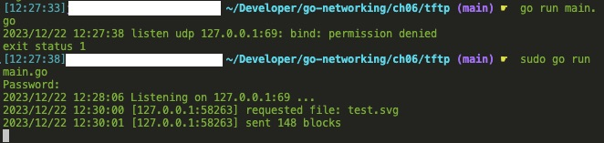
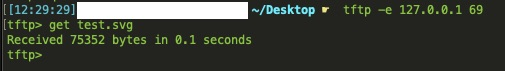
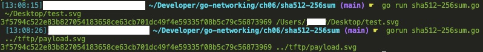

# Network Programming with Go

## Contents
- [Network Programming with Go](#network-programming-with-go)
  - [Contents](#contents)
  - [About](#about)
  - [Run](#run)
  - [File Structure](#file-structure)
  - [Notes on Network Programming with Go](#notes-on-network-programming-with-go)
    - [Chapter 4](#chapter-4)
    - [Chapter 5](#chapter-5)
    - [Chapter 6](#chapter-6)
    - [Chapter 7](#chapter-7)
    - [Chapter 8](#chapter-8)
    - [Chapter 9](#chapter-9)
  - [Notes on General Network Service Metrics](#notes-on-general-network-service-metrics)
  - [Notes on Useful Linux Commands for Troubleshooting](#notes-on-useful-linux-commands-for-troubleshooting)

## About

- Code examples from the book <i>Network Programming with Go</i> by Adam Woodbeck. 
- My notes from the book <i>Network Programming with Go</i> by Adam Woodbeck.
- Some network troubleshooting notes from <i>Devops for the Desparate</i> by Bradley Smith.

## Run

- Run all tests from the repository directory:  `go test -timeout 300s -race -bench=. ./...`
- Run specific test, for example,  `listen_test.go`: `go test -v -timeout 300s -race -bench=. ./ch03/listen_test.go`

## File Structure

- `ch03` Reliable TCP Data Streams
- `ch04` Sending TCP Data
- `ch05` Unreliable UDP Communication
- `ch06` Ensuring UDP Reliability
- `ch07` Unix Domain Sockets
- `ch08` Writing HTTP Clients
- `ch09` Building HTTP Services

## Notes on Network Programming with Go

### Chapter 4

- Using `net.Conn` interface is usually adequate and provides the best cross-platform support for TCP sessions.
- Using `net.TCPConn` offers more fine-grained control but at the cost of some compatibility (i.e., functionality will very between OSes).
  - Easiest way to access `net.TCPConn` object is by using a type assertion. This works for connections where the underlying network is TCP: 
    - `tcpConn, ok := conn.(*net.TCPConn)`

### Chapter 5

- Be careful using the `net.Conn` interface for UDP because you may forget that you still have to manually handle things like checking the sender.

### Chapter 6

- TFTP, Trivial File Transfer Protocol, is an example of an applicaiton protocol that ensures reliable data transfers over UDP (see RFC 1350). The example TFTP server we write in this chapter only allows clients to download binary data. It does not support uploads, ASCII (American Standard Code for Information Interchange) transfers, or some of the later additions to TFTP specified outside RFC 1350.
- "Please keep in mind that TFTP is not appropriate for secure file transmission. Though it adds reliability to UDP connections, it does not support encryption or authentication. If your application requires communication over UDP, you may want to use WireGuard ([https://github.com/WireGuard/wireguard-go/](https://github.com/WireGuard/wireguard-go/)), an application that allows for secure communication over UDP."
- Running the TFTP server:
  - First start the server we made in chapter 6:
  - 
  - Second start the TFTP server that is already extant on your local machine (or download one):
  - 
- Checksum notes: we do a SHA512/256 checksum which is a SHA512 checksum truncated to 256 bits because 1) calculating SHA512 on a 64-bit machine is faster (SHA256 uses 32-bit words), and 2) by truncating SHA512 to 256 bts we eliminate a length extension hashing attack that SHA512 is vulnerable to.
- Running the checksum utility:
  - 

### Chapter 7

- <b><i>Unix domain socket</i></b>: a communication method that uses the filesystem to determine a packet's destination address, allowing services running on the same node to exchange data with one another, a process known as <i>inter-process communication</i> (IPC). There are three types:
  - <i>Streaming sockets</i>: these operate like TCP and Go designates this type as `unix`.
  - <i>Datagram sockets</i>: these operate like UDP and Go designates this type as `unixgram`.
  - <i>Sequence sockets</i>: these combine elements of both TCP and UDP, and Go designates this type as `unixpacket`.
    - More specifically, these combine the session-oriented connections and reliability of TCP with the clearly delineated datagrams of UDP. However, sequence packet sockets discard unrequested data in each datagram. `unixpacket` has the least cross-platform support (e.g., Windows, WSL and macOS do not support them). Their hybrid behavior and discarding of unrequested data means `unix` and `unixgram` are better suited for most applications. `unixpacket` was largely used in old X.25 telecommunication networks, some types of financial transactions, and AX.25 (amateur radio).

### Chapter 8

- Go HTTP client's implicit draining of the response body on closing could potentially bite you. For example, let's assume you send a GET request for a file and receive a response from the server. You read the response's `Content-Length` header and realize the file is much larger than you anticipated. If you close the response body without reading any of its bytes, Go will download the entire file from the server as it drains the body regardless. A better alternative would be to send a `HEAD` request to retrieve the `Content-Length` header.
- On the rare occasion you make an HTTP request and want to explicitly drain the response body, the most efficient way is to use the `io.Copy` function:
  ```go
  _, _ = io.Copy(ioutil.Discard, response.Body)
  _ = response.Close()
  ```
- You must close the response body no matter wheterh you read it or not in order to avoid resource leaks.
- If you are in the middle of reading the response body when the context times out, your next read will immediately return an error. You can use generous time-out values or, alternatively create a context without a time-out or deadline and control the cancellation of the context exclusively by using a timer and the context's cancel function, like so:
  ```go
  ctx, cancel := context.WithCancel(context.Background())
  timer := time.AfterFunc(5*time.Second, cancel)
  // Make the HTTP request, read the response headers, etc.
  // ...
  // Add five more seconds before reading the response body.
  timer.Reset(5*time.Second)
  ```
- Disabling persistent TCP connections: because the number of active TCP connections a computer can maintain is finite, you may inadvertantly deny your computer the ability to open new ones due to the fact that Go's HTTP client maintains the underlying TCP connection to a web server after reading its response, unless explicitly told to disconnect by the server. If you write a program that makes one-off requests to numerous web servers, you can find that your program stops working after exhausting all your computer's available TCP connections, leaving it unable to open new ones. Instead of disabling TCP session resuse in the client, a more flexible option is to inform the client what to do with the TCP socket on a per-request basis. For example:
  ```go
  req, err := http.NewRequestWithContext(ctx, http.MethodGet, ts.URL, nil)
  if err != nil {
    t.Fatal(err)
  }
  req.Close = true
  ```

### Chapter 9

- We use the `html/template` package to create a template which automatically escapes HTML characters when you populate them and write the results to the response writer. This is important because otherwise the server we write in this chapter would be vulnerable to cross-site scripting attacks (XSS) where a request payload that includes JavaScript ends up running on a client's computer.
- Use the `net/http/httptest` package to make unit-testing handlers painless and includes a test server implementation for performing integration tests.
- Potential pitfall: the order in which you write to the response body and set the response status code matters. The client receives the response status code first, followed by the response body from the server. If you write the response body first, Go infers that the response status code is 200 OK and sends it along to the client before sending the response body. See [pitfall_test.go]("https://github.com/cipherphage/go-networking/ch09/handlers/pitfall_test.go").
  - Run the pitfall test and you'll see that this logs `Response status: "200 OK"`:
  ```go
  handler := func(w http.ResponseWriter, r *http.Request) {
		_, _ = w.Write([]byte("Bad request"))
		w.WriteHeader(http.StatusBadRequest)
	}
	r := httptest.NewRequest(http.MethodGet, "http://test", nil)
	w := httptest.NewRecorder()
	handler(w, r)
	t.Logf("Response status: %q", w.Result().Status)
  ```
  - Where as this logs `Response status: "400 Bad Request"`:
  ```go
  handler := func(w http.ResponseWriter, r *http.Request) {
    w.WriteHeader(http.StatusBadRequest)
		_, _ = w.Write([]byte("Bad request"))
	}
	r := httptest.NewRequest(http.MethodGet, "http://test", nil)
	w := httptest.NewRecorder()
	handler(w, r)
	t.Logf("Response status: %q", w.Result().Status)
  ```
  - Note: the handlers above could be simplified using `http.Error` like this:
  ```go
  http.Error(w, "Bad request", http.StatusBadRequest)
  ```

## Notes on General Network Service Metrics

The following notes are quoted from <i>Devops for the Desparate</i> by Bradley Smith.

<i>Golden Signals</i>:
- Latency: the time it takes for a service to process a request.
- Traffic: how many requests an application is receiving.
- Errors: the number of errors an application is reporting.
- Saturation: how full a service is. For example, measure CPU usage to determine how much headroom is left on the system before the application or host becomes slow or unresponsive.

<i>RED</i>:
- Rate: the number of requests per second a service is receiving.
- Error: the number of failed requests per second that the service encounters.
- Duration: the amount of time it takes to serve a request, or how long it takes to return the data requested from your service to the client.

<i>USE</i>:
- Utilization: the average time the resource is busy doing work.
- Saturation: the extra work the system could not get to.
- Errors: the number of errors a system is having.

## Notes on Useful Linux Commands for Troubleshooting

The following notes are quoted from <i>Devops for the Desparate</i> by Bradley Smith.

<i>High load average</i>:
- `uptime`.
- `top`.
- For more information about particular processes: `vmstat`, `strace`, `lsof`.

<i>High memory usage</i>:
- `free -hm` \<flags: human-readable, mebibyte\>.
- `vmstat 1 5` \<parameter: delay in seconds\> \<parameter: count\>.
- `ps -efly --sort=rss | head` \<flags: show all processes in long format, sort by resident set size (amount of non-swappable physical memory a process uses)\> \<pipe: `head` command (displays first ten lines by default)\>.

<i>High I/O wait</i>:
- `iostat -xz 1 20` \<flags: show active devices with extended stat format\> \<parameter: delay in seconds\> \<parameter: count\>.
- `iotop -oPab` \<flags: show processes performing I/O with accumulative stats in batch mode\>.

<i>Hostname resolution failure</i>:
- `/etc/resolv.conf`.
- `resolvectl dns`.
- `dig @<upstream dns ip> <hostname>`.

<i>Out of disk space</i>:
- `df -h` \<flags: human-readable\>
- `find / -type f -size +100M -exec du -ah {} + | sort -hr | head` \<flags: type: file, size: more than 100MB, execute: file size on disk in human-readable format\> \<pipe: `sort` command (sorts descending) with human-readable flag\> \<pipe: `head` command (displays first ten lines by default)\>
- `lsof /var/log/<filename>.log` (note: the example from the book is that a large log file caused the out-of-disk-space problem, hence why the `lsof` command is being used to get info on an open log file and the following `logrotate` command is recommended).
- `logrotate` and it's config file `/etc/logrotate.d/`.

<i>Connection refused/timeout</i>:
- `curl <url>`.
- `ss -l -n -p | grep <port>` \<flags: shows listening sockets, do not resolve service names, shows the process using the socket\> \<pipe: `grep` command to filter for specific port\> (note: "ss" stands for "socket statistics").
- `tcpdump -ni any tcp port <port number>` \<flags: do not resolge host or port names, specifies the network interface (`any` means listen on all interfaces), specifies type of packets (tcp) and which port number\>.

<i>Searching logs</i>:
- `systemd` and `journal` services.
  - `journalctl -r` \<flags: reverse order (so newest is on top)\>.
  - `journalctl -r --since "2 hours ago"`.
  - `journalctl -r -u ssh` \<flags: filter on service name ("u" stands for "unit")\>.
  - `journalctl -r -u ssh -p err` \<flags: specify priority level\>.
  - `journalctl -r -u ssh -g "session opened"` \<flags: match on regular expression (similar to piping to `grep`)\>.
- Parsing logs:
  - `grep <string or pattern to match> <filename or stream>`.
    - `grep "10.0.2.33" /var/log/syslog`.
    - `grep -B 5 "user NOT in sudoers" /var/log/auth.log` \<flags: show \<number\> of lines before matched line\>.
  - `awk <string or pattern to match> <filename or stream>` similar to `grep` but can filter on columns.
    - `awk '{print $1}' /var/log/nginx/access.log` \<parameter: print first column\>.
    - `awk '($9 ~ /500/)' /var/log/nginx/access.log` meaning: search for all HTTP 500 response codes (usually in the ninth column) in the Nginx access log file. Inside the parantheses, the tilde (~) is a field number that tells `awk` to apply the search pattern only to a specific column.
    - `awk '($9 ~ /404/) {if (/POST/) print}' /var/log/nginx/access.log` similar to the one above: match the value at column $9 to the number 404, then pass an `if` block that states, "if the line from the column $9 match contains the word POST anywhere in it, pring that whole log line."
    - Another similar example, this time using the pipe symbol as a logical OR operator: `awk '($9 ~ /401|403/)' /var/log/nginx/access.log`.
- Common log files on linux systems:
  - `/var/log/syslog`
  - `/var/log/auth.log`
  - `/var/log/kern.log`
  - `/var/log/dmesg`

<i>Miscellaneous</i>:
- `strace -s 128 -p 19419` \<flags: message output size (128 bytes), specifies a process ID or PID\>, traces system calls and signals (note: this command can be very verbose and may cause performance issues).
  - `strace -f -c` \<flags: forked: follow any new processes created, summary flag produces on-going overview of what system calls the process is using\>.
  - `strace -p 28485 -e openat -o mytracefile.txt` \<flags: specifies a process ID or PID, specifies a particular system call, output to \<filename\>\>.
  - Similar to `strace`: `ltrace` reports dynamic library calls, `dtrace` can trace kernel-level issues. 
- `nmap` testing network connections.
- `iptables` and it's helpful wrapper `ufw` for allowing, blocking, and filtering connections.